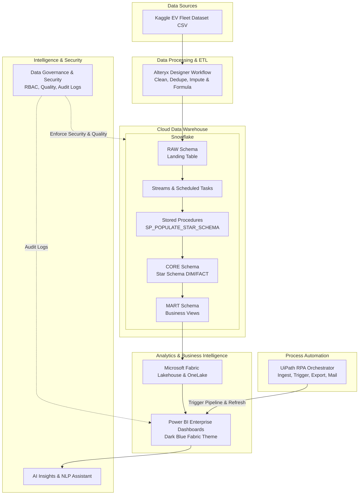
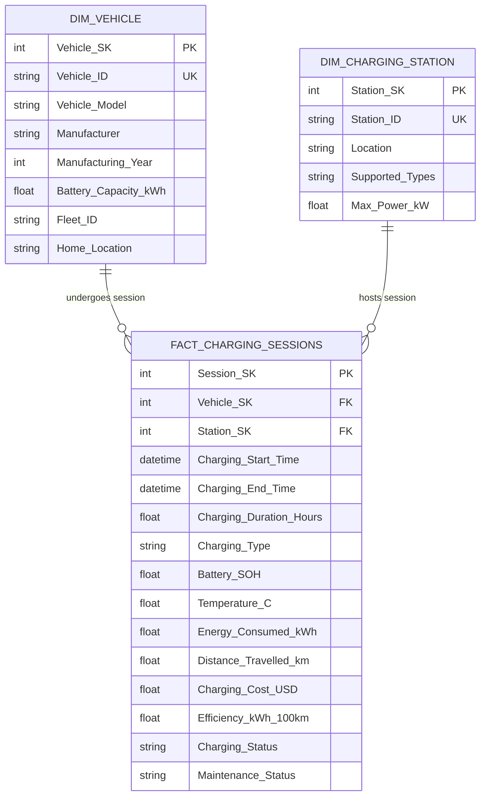
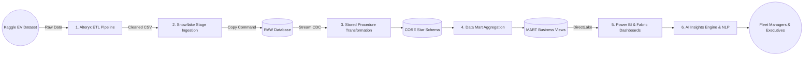
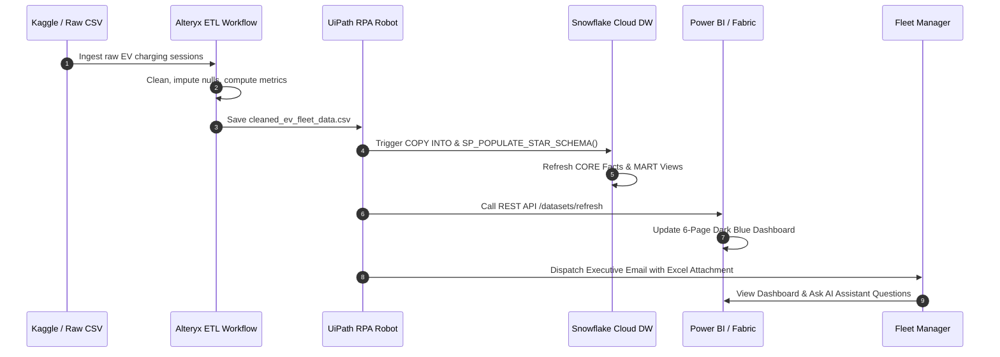
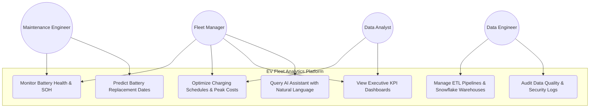
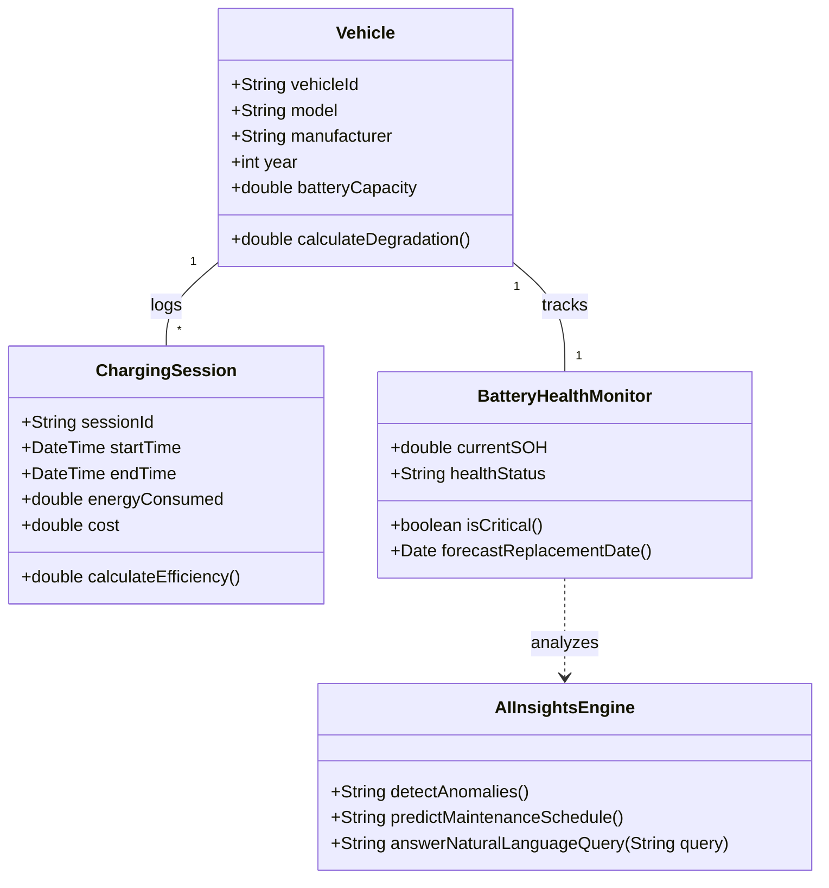

# Enterprise System Architecture & UML Diagrams

This document contains full visual diagrams representing the architecture, data flow, entity relationships, sequence execution, use cases, classes, and deployment topology of the **EV Fleet Charging & Battery Health Analytics Platform**.

---

## 1. Solution Architecture Diagram



---

## 2. Entity Relationship Diagram (ERD)



---

## 3. Data Flow Diagram (DFD - Level 1)



---

## 4. Sequence Diagram



---

## 5. Use Case Diagram



---

## 6. Class Diagram



---

## 7. Deployment Diagram

```mermaid
graph TB
    subgraph Client Environment
        UserBrowser[Web Browser / Power BI Desktop]
    end

    subgraph Cloud Infrastructure (AWS / Azure)
        subgraph Snowflake Cloud Data Platform
            SF_ETL[EV_ETL_WH - Medium]
            SF_BI[EV_ANALYTICS_WH - Large]
            SF_STORAGE[(EV_FLEET_DB Storage)]
        end

        subgraph Microsoft Fabric Cloud
            OneLake[(OneLake Lakehouse)]
            FabricPipeline[Fabric Data Factory]
            PBIServer[Power BI Service Workspace]
        end

        subgraph Automation Cloud
            UiPathOrch[UiPath Orchestrator Server]
        end
    end

    UserBrowser -->|HTTPS / WSS| PBIServer
    PBIServer -->|DirectLake| OneLake
    OneLake <-->|Zero-Copy / Mirroring| SF_STORAGE
    UiPathOrch -->|REST API & ODBC| SF_ETL
    FabricPipeline -->|Ingest| OneLake
```
